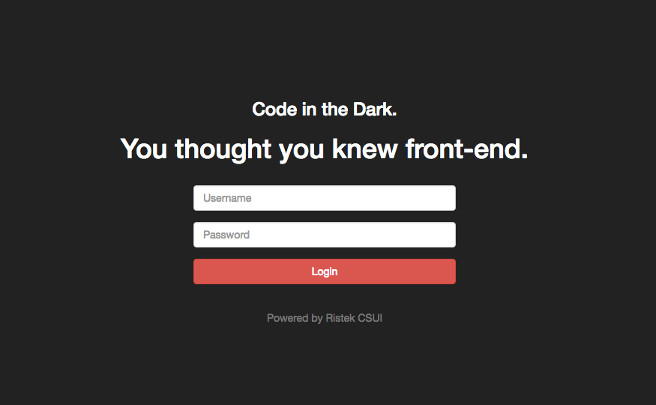

Code In The Dark Platform
=========================

Web platform for Code in the Dark competition at Pekan Ristek 2015, hacked together in a week.



## NOTE!

This was meant for a one-off, one night competition. We didn't hash the passwords (terrible!) for easier password distribution to contestants, but if you want to deploy this to production, please hash them. You have been warned.

## Requirements

- Node.js and npm
- MongoDB running on localhost

## Technologies used

- [Ace Editor](https://ace.c9.io/#nav=about) for the fantastic web-based editor
- [Socket.IO](http://socket.io/) for real-time client-server communications
- [Express.js](http://expressjs.com/) as the web server

## Setting up

1. Clone this repository and cd into it
2. `npm i` (installing dependencies, may take a while)
3. `node populateUser.js` (populate the user database with random six chars passwords)
4. `npm start` (start the server)
5. Open localhost:3000

## How to use

### Getting the username and passwords

Step 3 of "Setting Up" should give you users in your mongo `codes` collection. Observe them with using the `mongo` client:

```
$ mongo
> use citd
switched to db citd
> db.codes.find()
{ ... "username" : "admin", ... "password" : "f12610", ... }
{ ... "username" : "user1", ... "password" : "963cc4", ... }
{ ... "username" : "user2", ... "password" : "504193", ... }
{ ... "username" : "user3", ... "password" : "d15795", ... }
{ ... "username" : "user4", ... "password" : "8e6b34", ... }
...
```

Distribute the username and passwords to your contestants.

### As a contestant

1. Open the app, login using the provided username and password.
2. You will be presented with a web-based editor.
3. Click on the "Videos & Assets" on the upper-right to see the instructions of the competition.
4. Start coding in the dark! Don't forget to regularly use Ctrl-S (or Cmd-S) to save your work!
5. When the time is up, a message will appear and the editor and saving will be disabled.
6. Go to `/logout` to log out of the app.

### As admin

1. Open the app, login using admin username and password
2. You will be shown several thumbnails of the contestants' works.
3. You can:
  - Preview each one
  - Show the usernames (upper-right checkbox)
  - End the competition (also upper-right button)

### As public preview

1. Open the app at `/public` (no need to login)
2. You can preview each of the work

## Routes

- `/`: Login route
- `/code`: Editor route for contestants
- `/admin`: Admin route for previewing and closing the competition
- `/public`: For public previews
- `/logout`: Logout route

## Contributing

Found a bug or have a feature request? Go open an issue first! If you want to tackle it yourself, state so in the issue to notice people that you're working on it. Then:

- Fork this repo
- Use your feature branch for developing (i.e. `server`, `contestant`, or `admin`, etc.).
- Start hacking!
- Use descriptive commit messages.
- If there's an update on master, rebase. Always rebase before opening a pull request.
- Finished on the bugfix/feature? Open a pull request to `master`.

## Acknowledgements

Thanks for the team that hacked this together!

- [@bobbypriambodo](https://github.com/bobbypriambodo)
- [@salsanads](https://github.com/salsanads)
- [@Frauklein](https://github.com/Frauklein)
- [@mgilangjanuar](https://github.com/mgilangjanuar)

## License

MIT
